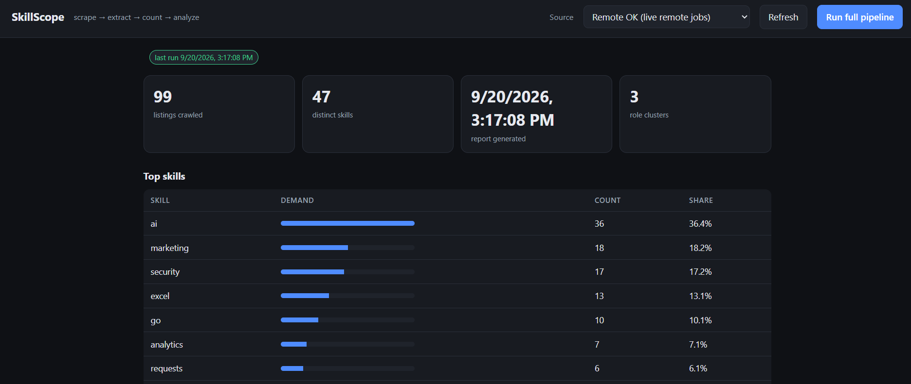

# SkillScope



SkillScope is a job-market intelligence pipeline: it crawls live job boards
(Remote OK, Arbeitnow) and extracts skills from every listing, then reports
demand stats, role-family clusters and MapReduce term counts — through a CLI
or a vanilla-JS web UI.

```
Scrapy crawl ──► TinyDB (NoSQL) ──► NLTK skill extraction ──►
   pandas + scikit-learn analysis ──► report.json + FastAPI
              + a multiprocessing MapReduce counter (skills & terms)
```

Scrapy genuinely crawls real, live job boards and persists what it finds via an
Item pipeline (index → detail pages, download delay, retries, de-dup upserts).
The crawl target is pluggable:

| Source | What it is | robots.txt |
| --- | --- | --- |
| `remoteok` *(default)* | live remote jobs via Remote OK's public endpoint | allows, crawl-delay 1s |
| `arbeitnow` | live jobs (mostly EU) via Arbeitnow's open API | allows crawling |
| `demo` | the local offline board (`demo_board.py`) — deterministic, zero network, used for tests | n/a |

Remote OK's page HTML is a JS shell and We Work Remotely Cloudflare-blocks
requests, so the live sources use those boards' public, crawler-friendly JSON
endpoints — still real, current listings scraped over HTTP, not fabricated
data. `demo` keeps the repo self-contained and lets the pipeline run offline.

---

## Quick start

```bash
python -m venv .venv && source .venv/bin/activate
pip install -r requirements.txt
python run.py nltk-data        # NLTK punkt_tab + stopwords (once)
python run.py all              # scrape Remote OK (live) → extract → count → analyze
python run.py all --source arbeitnow   # live EU jobs instead
python run.py all --source demo        # offline deterministic board
python run.py serve            # web UI + read API on :8000
python -m pytest               # 9 tests
```

`python run.py all` prints the market snapshot directly; the same data is
written to `data/` (`report.json`, `top_skills.csv`, `clusters.csv`). Each run
starts from a fresh store, so the report reflects only the source you picked.

## Web UI (no terminal needed)

`python run.py serve` then open <http://127.0.0.1:8000/> — a plain-vanilla-JS
page served by the FastAPI app (one `index.html`, no build step, no Node).
Pick a **Source** (Remote OK / Arbeitnow / Demo board) in the header, hit
**Run full pipeline** (`POST /run?source=…&limit=…`, run as a subprocess so
Scrapy's Twisted reactor and the MapReduce pools stay out of uvicorn), and the
page renders the result: summary stats, top skills, role clusters, MapReduce
counts and the listing table. `Refresh` just re-reads the current data; the
pipeline logic is shared with the CLI:

   python run.py scrape --source remoteok --limit 100   (or arbeitnow / demo)

---

## How each job-spec bullet is covered

| Spec bullet | Where |
| --- | --- |
| **Scrapy** | `crawler.py` — three Spiders (`remoteok`, `arbeitnow`, `demo`) + an `Item` **pipeline** that persists into the store; polite delay, retries, `ROBOTSTXT_OBEY`. Run directly too: `scrapy runspider crawler.py` |
| **NLTK** | `skillscope/extract.py` — `word_tokenize` with an 89-skill dict, longest-match-first; punctuation-multi-token skills (`c++`, `.net`, `node.js`, `c#`, `ci/cd`, `power bi`) matched on raw text; regex fallback when the corpora are missing |
| **pandas** | `skillscope/analyze.py` — the TinyDB store becomes a DataFrame; demand stats, shares, `top_skills.csv` / `clusters.csv` |
| **scikit-learn** | `skillscope/analyze.py` — one-hot skill vectors, `TfidfTransformer` down-weights ubiquitous buzzwords, `KMeans` groups listings into role clusters named by their most *distinctive* skills |
| **mapreduce** | `skillscope/mapreduce.py` — a real map → shuffle → reduce over multiprocessing pools; `count_skills` is the classic job |
| **nosql** | every write goes through TinyDB (`skillscope/store.py`); the module is the only place that touches the store, so swapping in MongoDB later is a one-file change |
| **FastAPI** *(extra)* | `skillscope/api.py` — web UI at `/` + `/listings`, `/skills/top`, `/report`, `POST /run` |
| **pytest** *(extra)* | `tests/test_extract.py`, `tests/test_mapreduce.py` |

---

## Real numbers (from the live Remote OK crawl)

Nothing is hard-coded — everything is computed from whatever `data/jobs.json`
holds after your last crawl, so numbers drift with the live feed. The snapshot
shipped in `data/` (99 unique listings, current Remote OK feed):

```
listings:            99
distinct skills:     47
top 5 skills:        ai, marketing, security, excel, go
clusters:
  0: cluster 0: requests, analytics, kubernetes, .net, sql      (backend/engineering)
  1: cluster 1: excel, go, salesforce, figma, crm               (generalist/business)
  2: cluster 2: marketing, security, oracle, salesforce, python (sales/product)
```

The `demo` source reproduces the deterministic numbers below (12 listings):

```
listings:            12
distinct skills:     34
top 5 skills:        pandas, scikit-learn, docker, nltk, python
clusters:
  0: cluster 0: spacy, pytorch, fastapi, tensorflow, go                (ML/NLP)
  1: cluster 1: mongodb, kafka, spark, sql, airflow                    (data/streaming)
  2: cluster 2: redis, prometheus, terraform, kubernetes, jenkins      (devops)
```

---

## Layout

```
SkillScope/
├── crawler.py          # 3 Scrapy spiders (remoteok/arbeitnow/demo) + TinyDB pipeline
├── demo_board.py       # offline demo job board (real HTTP crawl target)
├── run.py              # CLI: scrape | extract | count | analyze | all | serve
├── skillscope/
│   ├── store.py        # TinyDB (NoSQL) document store
│   ├── extract.py      # NLTK skill extraction
│   ├── mapreduce.py    # MapReduce over multiprocessing pools
│   ├── analyze.py      # pandas + scikit-learn stats / clusters / report
│   ├── api.py          # FastAPI web UI + read API + POST /run pipeline
│   └── static/         # vanilla-JS web UI (index.html)
└── tests/              # pytest suite
```

Add a source by dropping a new Spider class into `crawler.py`'s `SOURCES` map;
the pipeline, store, extraction and analysis never change.
